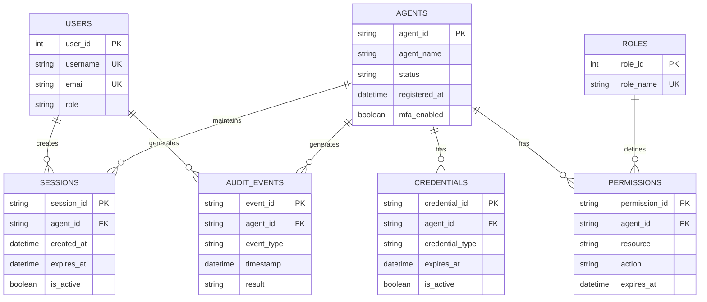

## ERD (Mermaid)

```mermaid
erDiagram
    USERS ||--o{ SESSIONS : creates
    USERS ||--o{ AUDIT_EVENTS : generates
    AGENTS ||--o{ CREDENTIALS : has
    AGENTS ||--o{ SESSIONS : maintains
    AGENTS ||--o{ PERMISSIONS : has
    AGENTS ||--o{ AUDIT_EVENTS : generates
    ROLES ||--o{ PERMISSIONS : defines

    AGENTS {
        string agent_id PK
        string agent_name
        string status
        datetime registered_at
        boolean mfa_enabled
    }

    CREDENTIALS {
        string credential_id PK
        string agent_id FK
        string credential_type
        datetime expires_at
        boolean is_active
    }

    SESSIONS {
        string session_id PK
        string agent_id FK
        datetime created_at
        datetime expires_at
        boolean is_active
    }

    PERMISSIONS {
        string permission_id PK
        string agent_id FK
        string resource
        string action
        datetime expires_at
    }

    AUDIT_EVENTS {
        string event_id PK
        string agent_id FK
        string event_type
        datetime timestamp
        string result
    }

    USERS {
        int user_id PK
        string username UK
        string email UK
        string role
    }

    ROLES {
        int role_id PK
        string role_name UK
    }
```

To export a PNG, render this Mermaid block with a Mermaid CLI or an online renderer.
